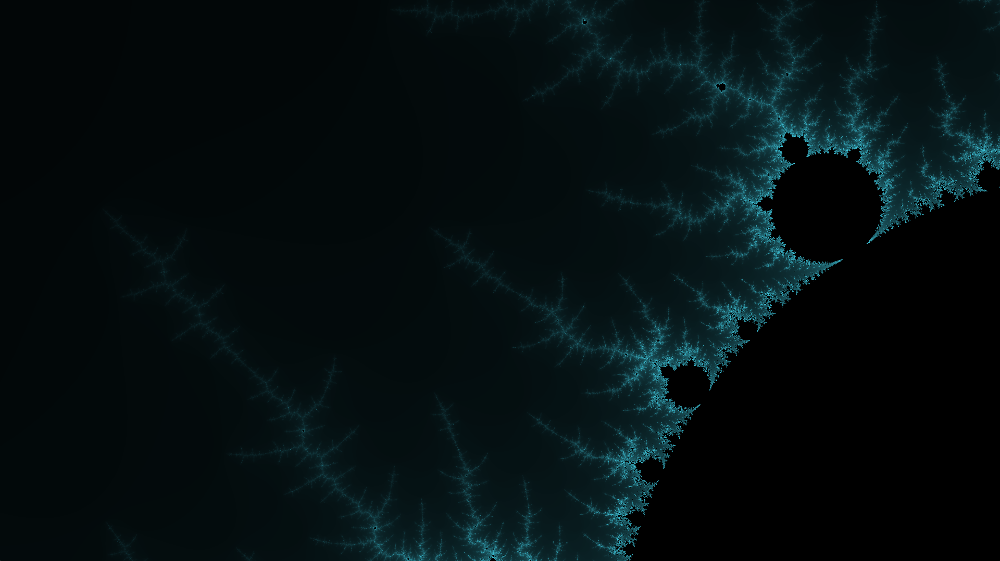
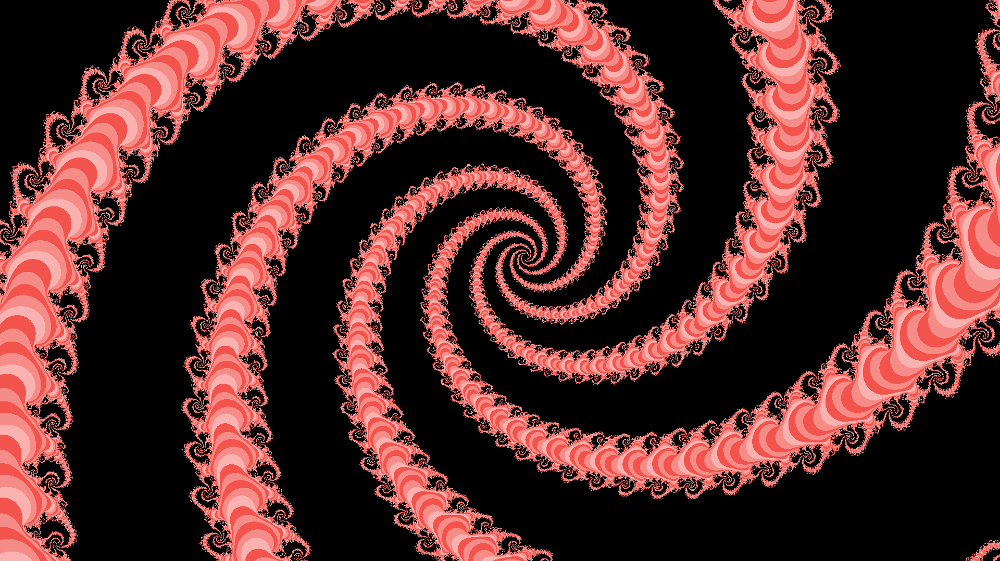
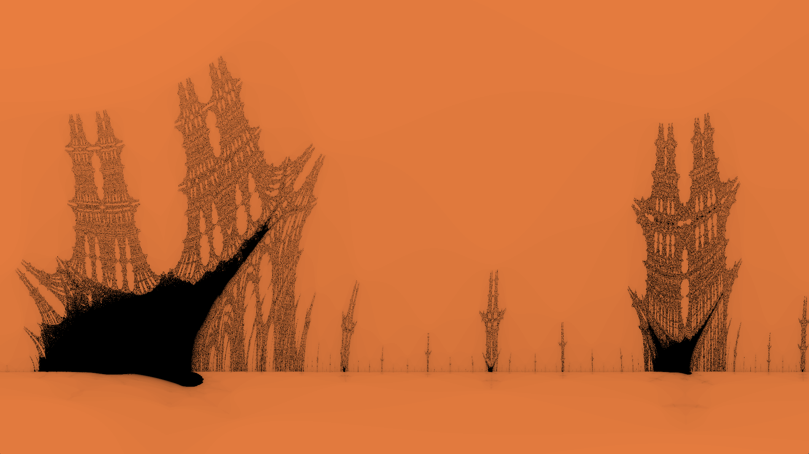

# Fractol

Fractol est un programme d'exploration de figures fractales. ([Qu'est-ce qu'une fractale ?](https://fr.wikipedia.org/wiki/Fractale))

Ce programme a été realisé dans le cadre de mes études à l'école 42, à Paris.
Il est ecrit en C, et utilise la librairie graphique de l'école [MinilibX](https://achedeuzot.me/2014/12/20/installer-la-minilibx/) pour l'affichage,
ainsi que le framework [OpenCL](https://www.khronos.org/opencl) 1.2 pour optimiser les temps de calcul.
Vous pouvez trouver le sujet du projet [ici](./fract_ol.fr.pdf).

---
### Prérequis

Pour utiliser Fractol, vous aurez besoin :
* d'un système MacOS,
* du logiciel Make,
* du compilateur clang (pour les fichiers sources)
* du compilateur openclc (pour les fichiers kernels).

Pour compiler le programme, lancez simplement la commande `make` dans le dossier du projet.

---
### Comment utiliser Fractol ?

la commande `./fractol` suivi du nom de la figure voulu vous permet d'executer le programme.
La même commande sans argument vous permet de savoir quels sont les differentes figures disponibles.

Lors de l'execution du programme, vous pouvez :
* Déplacer la figure avec les flèches du clavier,
* Augmenter/Diminuer le nombre d'itération avec +/- (partie pad numérique),
* Zoomer/Dézoomer avec la molette de la souris,
* Revenir a la position de départ avec R,
* Bloquer/Débloquer la figure avec S (pour Julia et Multibrot),
* Changer de palette de couleur avec 1, 2, 3 et 4 (partie alphanumérique),
* Quitter le programme avec ESC.

De plus, vous pouvez changer la couleur à l'aide de la deuxieme fenêtre qui s'ouvre lors de l'execution.
Son utilisation est très simple:
* Choisissez une couleur en cliquant sur la palette à gauche,
* Choisissez une nuance en cliquant dans le carré à droite.

La couleur est automatiquement mis à jour dans la fenêtre principal.

---
### Exemples

#### Mandelbrot

#### Julia

#### Burning Ship

